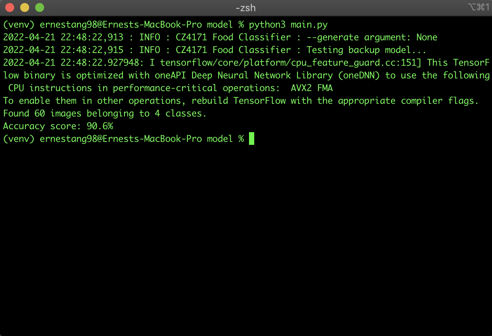

# CZ4171 Food Classifier

Convolutional Neural Network (CNN) AI Model created using tensorflow to predict 4 categories of food:

1. Apple Pie

2. Barbeque Ribs

3. Ramen

4. Sushi

### Dataset

- Food101 Dataset, available on [kaggle](https://www.kaggle.com/dansbecker/food-101)

- The full dataset was too huge and due to a lack of space, I could not train the entire dataset

### Notes:

- Create virtual environment under `model/` not `model/scripts/`

### Commands (under `scripts/**`)

- `python3 main.py --generate True` to generate model

- `python3 main.py` to evaluate model

- `python3 predict.py --image path/to/img.jpeg` to predict 

- `python3 predict.py --image path/to/img.jpeg --type BYTE` to convert image into bytes before prediction

- `python3 predict.py --quick True` to quickly test all images in the `images_for_predict_script/` directory with model

- Run the following to deploy model on docker after generating .pb model

	```
	docker pull tensorflow/serving
	docker run -p 8501:8501 --name cz4171 -v "$(pwd)/backup/saved_model:/models/cz4171/1" -e MODEL_NAME=cz4171 tensorflow/serving &
	```

- Deployment to heroku, follow this [link](https://medium.com/@mohamed.10592/from-building-to-deploying-deep-learning-models-using-tensorflow-docker-and-heroku-d6ab37e9117d). Make sure to perform these steps in the model directory.

	```
	docker build -t cz4171_tf_server .
	docker run -p 8501:8501 --name cz4171_tf_container -e PORT=8501 -t cz4171_tf_server &
	heroku login
	heroku container:login
	heroku create cz4171-tf-server
	heroku container:push web -a cz4171-tf-server
	heroku container:release web -a cz4171-tf-server
	```
	
	- Error 1: Servable not found for request: Latest(cz4171), reference [here](https://github.com/kubeflow/training-operator/issues/552)

	- Error 2: No versions of servable <model> found under base path, reference [here](https://stackoverflow.com/questions/45544928/tensorflow-serving-no-versions-of-servable-model-found-under-base-path)

### Performance

- Trainset: 90 - 95%

- Testset: 85 - 90%

	
